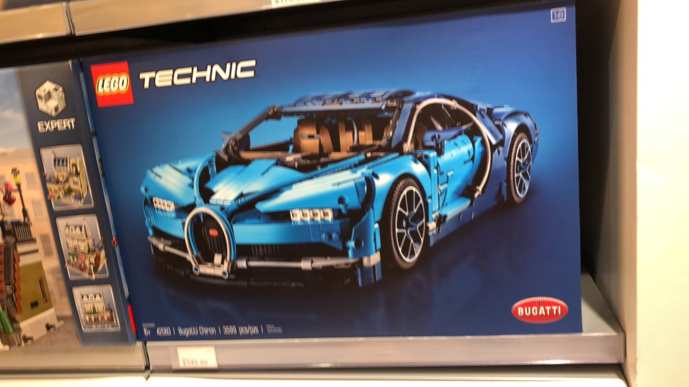
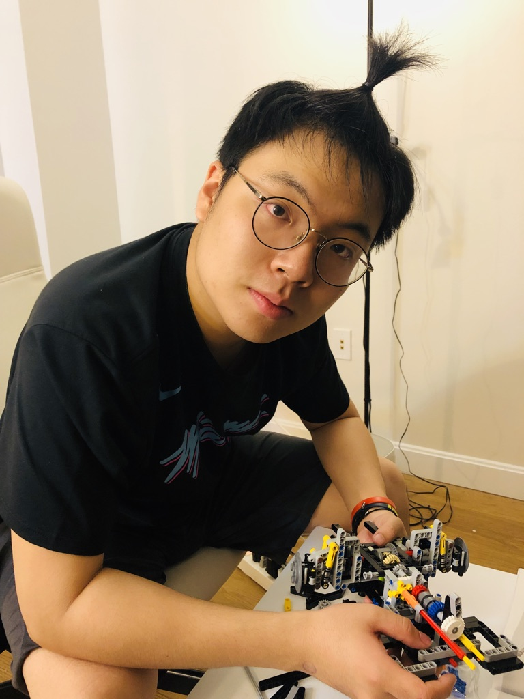
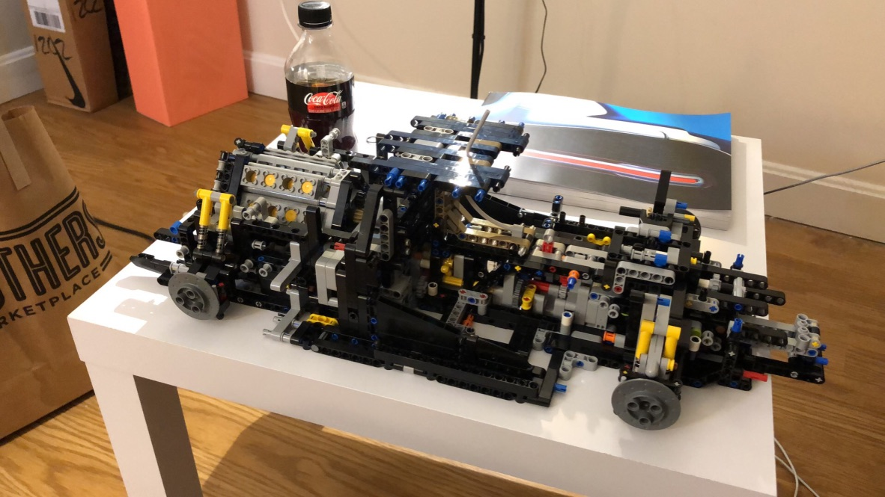
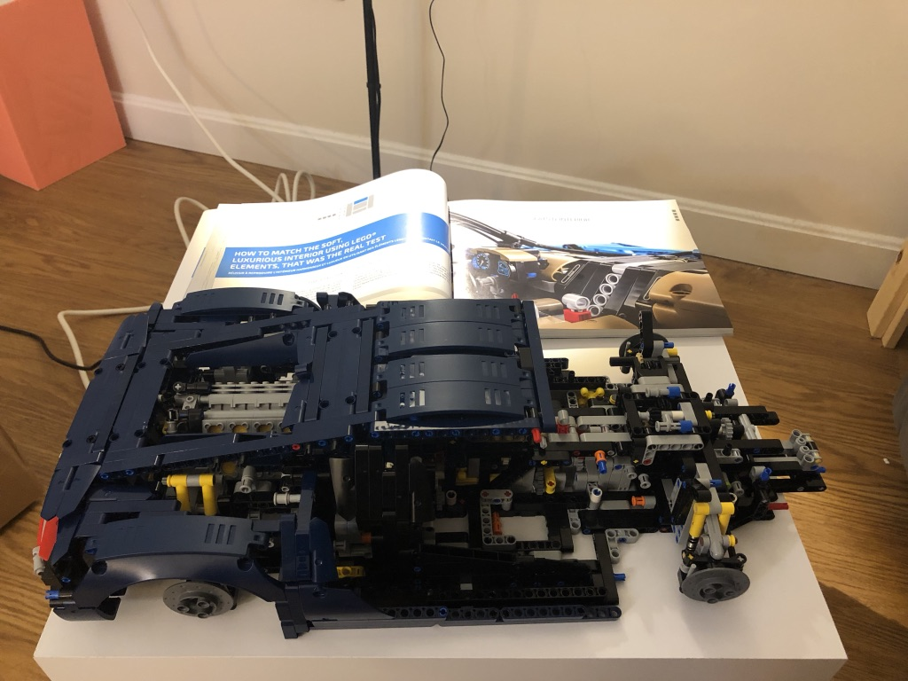
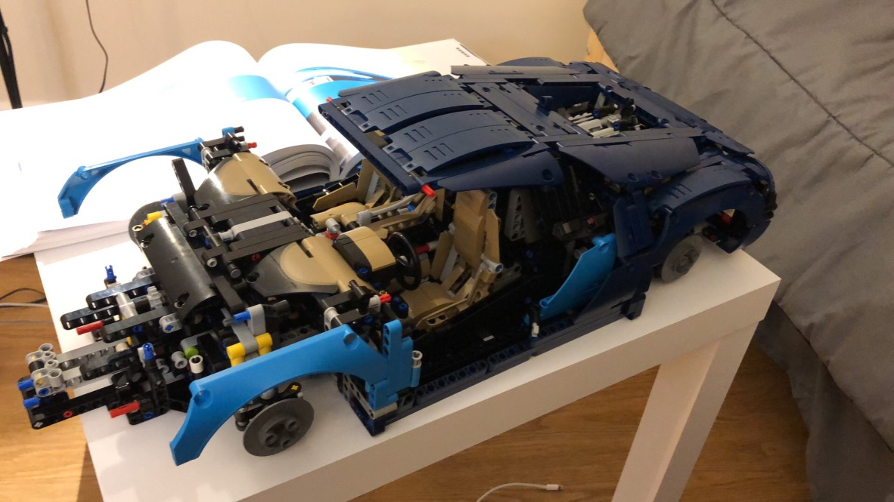
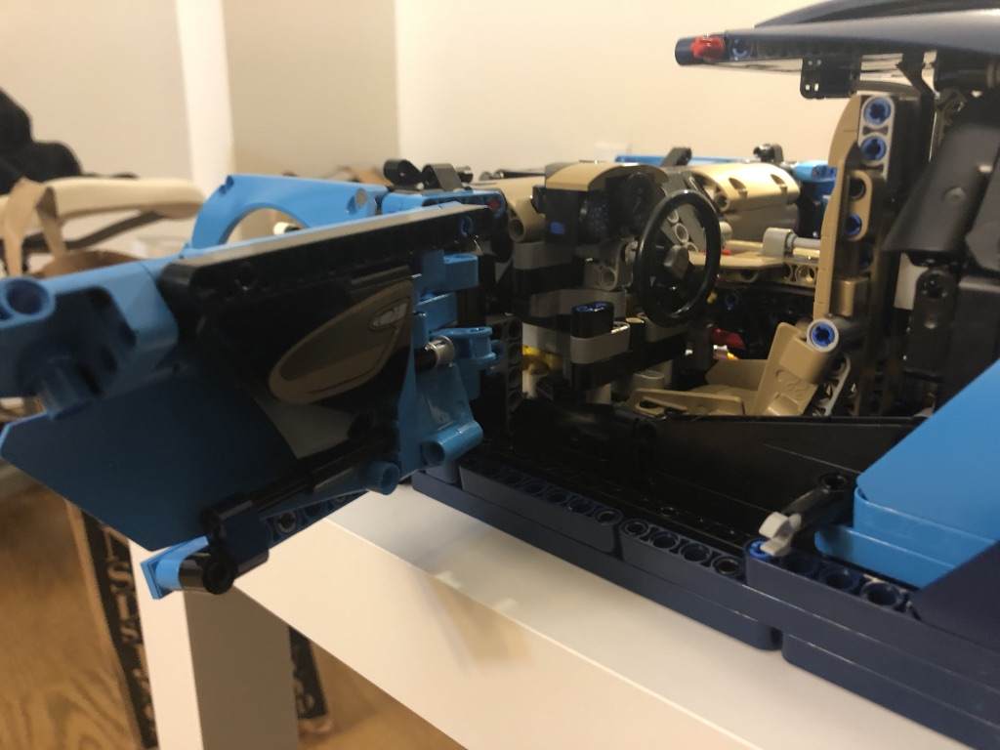
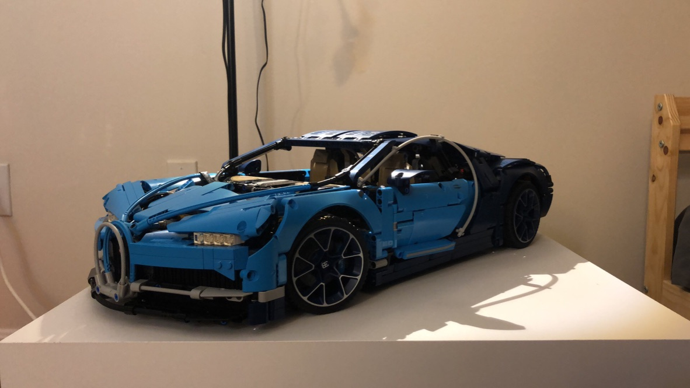
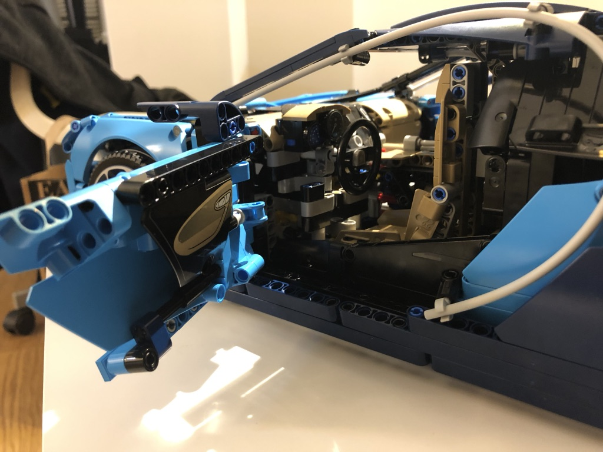
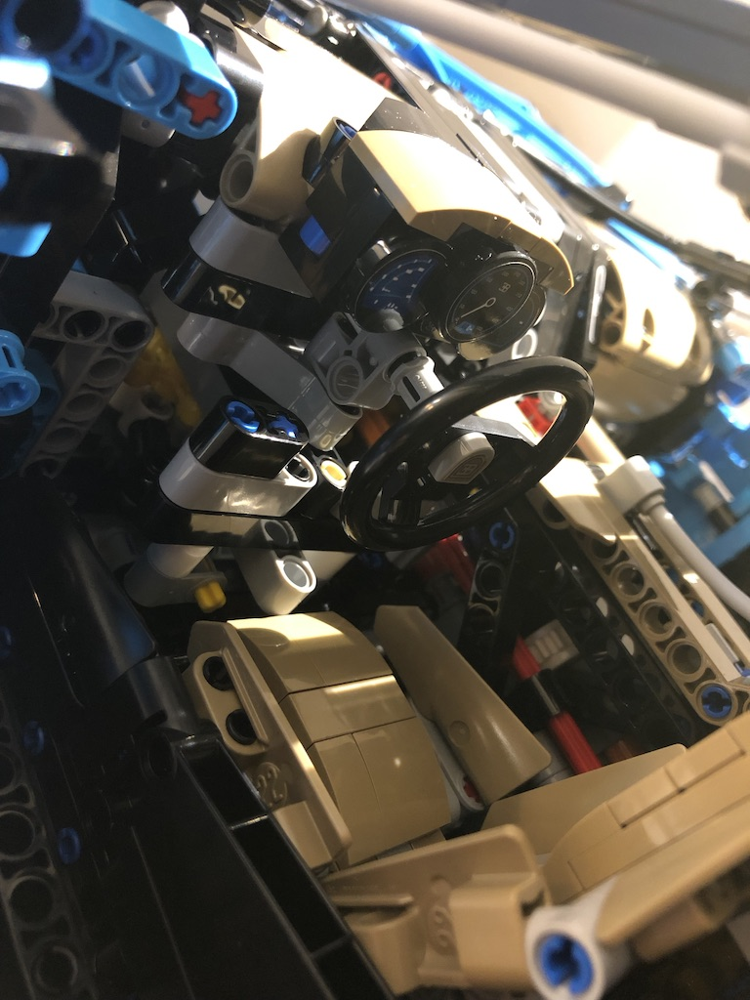

When I got my first payroll from my intern, I bought a LEGO Bugatti Chiron for myself! This set is always my favourite set but it's also always too expensive for me... 

*Let's do it!*

One of the most charming part for LEGO techinic sets is that it preserves the original design for all the things. For this set, it keeps the internal design for the veichle, including the engine, the gearbox and the case.

It's the picture of the engine:

These are the pictures I took during the process...

It took me nearly a month to finish it! Partly because I didn't have a lot of time for it and still I got a lot of work to do for my internship XD.

