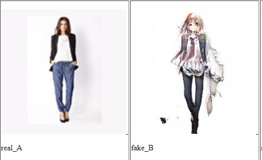
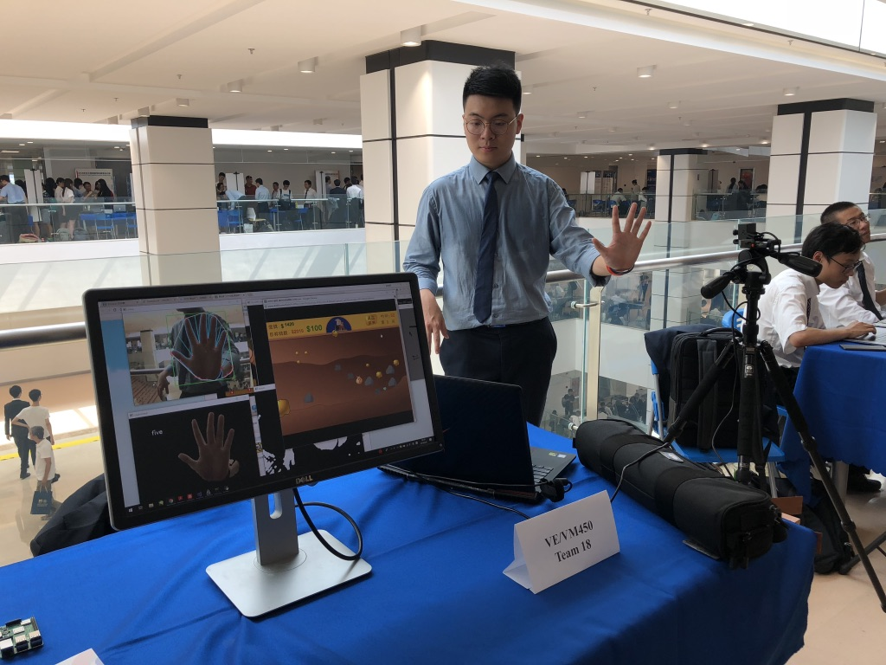

My Name is Hengjia Zhang (张恒嘉). Currently I'm a master student major in Computer Science and Engineering at the Univeristy of Michigan and planning to graduate in May, 2020. I got dual degrees in Computer Science at the University of Michigan and in Electrical and Computer Engineering at Shanghai Jiao Tong University. 

My main interest is in machine learning and deep learning. I was a member of [Michigan Database Research Group](<http://dbgroup.eecs.umich.edu/index.html>) and of [GEMS LAB](<http://web.eecs.umich.edu/~dkoutra/group/index.html>). 

Last year, when I was taking deep learning course by [Honglak Lee](<https://web.eecs.umich.edu/~honglak/>), our final project is the convertion/translation between real person images and anime images based on CycleGAN. The main modifcation is that we changed the architecture of generator and discriminator: for discriminator, we add dialtion convolutional layers to better extract global image features and add skip connections on generator so that it can preserve more image details.

When I was an undergraduate, one of my research projects is a JAVA code autocompletion based on machine learning algorithms and visualization through editor ATOM.  Its final goal is trying to develop a system which can write the code itself! 

Also, my team and I developed a gesture recognition system under complicated background with an accuracy of 100% and response time of 60 milliseconds per frame for [Panasonic](<https://na.panasonic.com/us/>). We use the gesture as game input to prove that it's robust and fast.

Right now I'm a deep learning intern in the Mathworks and working on pre-trained Keras Model transformation in MATLAB. Before that I was a Graduate Student Instructor at UM for EECS 486 Web Search and Information Retrieval, where I led discussion session, held office hour and created exams for the students.

<!-- I was born in Jilin City and came to Shanghai when I was a little boy. I spent 6 years in Shanghai Experiment School for both junior High School and High School. -->

<!-- Hey there! This page is included as an example. Feel free to customize it for -->
<!-- your own use. -->
<!--  -->
<!-- Follow [instructions](<http://www.texts.io/support/0017/>) to publish your blog -->
<!-- on GitHub Pages. -->
