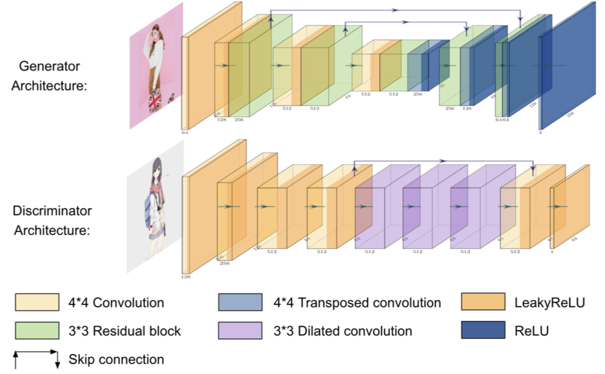
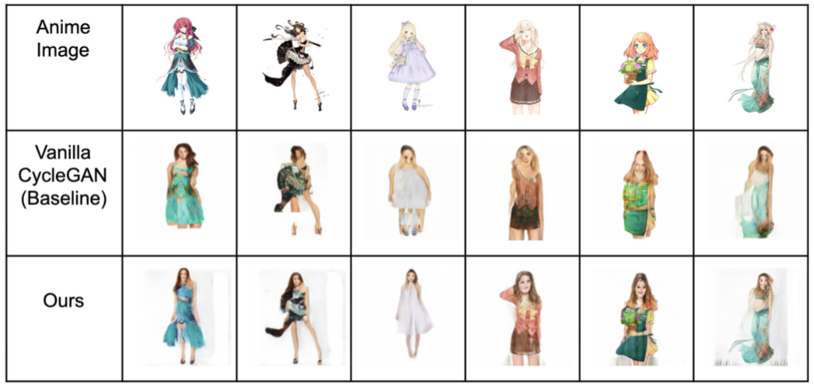
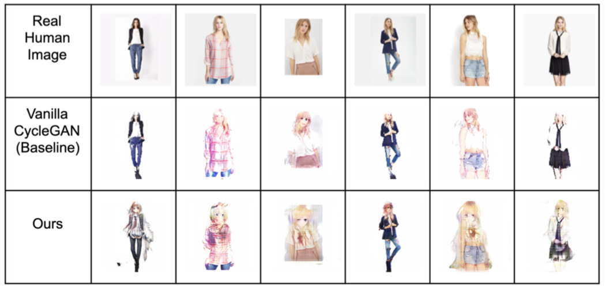

## Deep Learning Intern at The Mathworks
#### May 2019 - Aug 2019, Natick, MA

Here I'm working on KerasImporter for MATLAB.

---
## Translation between Real Person and Anime Character by using CycleGAN
#### Jan 2019 - Apr 2019, Ann Arbor, MI

*A*nimeTo*R*eal*T*ransformation*GAN* is about translation between a real person and an anime character based on CycleGAN. The final result was impressive. We manually collected and cleaned about 15000 data includes both real person images and anime character images for training and the data was trained on my NVIDIA1070 for almost one week. Since we couldn't map every detail from real person to anime character or anime character to real person, the original design of CycleGAN may not perform very well in this case. Therefore, in order to let the discriminator learn global features about the images better, I added some dilated convolution layer to the discriminator so that it could classify the images more broadly. In addition, to preserve the images details, skip connections was also added on the generator.

*The Architecture of ARTGAN*

The final result of ARTGAN:

*Anime to Person Transformation*

*Person to Character Transformation*

---
## Can Community Detection Help Link Prediction: An Empirical Study
#### Jan 2019 - Apr 2019, Ann Arbor, MI

TODO: finish this part

---
## Graduate Student Instructor for EECS 486 Information Retrieval
#### Jan 2019 - Apr 2019, Ann Arbor, MI

TODO: finish this part

---
## Smart Fiction Search Engine
#### Sep 2018 - Dec 2018, Ann Arbor, MI

This project is to develop a Smart Fiction Search Engine which searches books based on plot and context. About 5000 books for their descriptions and relative reviews were crawled, about 30 reviews for each book and build an Inverse Index database for it. Based on that, I implemented Okapi BM25 for books and used it as the ranking function for fictions retrieved. In order to test the performance of the search engine, we created 400 queries ourselves and compared the performance between our own book search engine and Google Books Search Engine. The result shows that our top 10 accuracy was 72.5% while Google's accuracy was 48.3%.

---
## Gesture Recognition System under Complicated Background
#### May 2018 - Aug 2018, Shanghai, China

TODO: finish this part

---
## Data-driven Programming System on Java Code Prediction
#### Jan 2017 - Apr 2018, Michigan Database Research Group, Ann Arbor, MI

In this project, I aimed  to use algorithm to refine and eventually achieve automate code writing. The end goal is to develop a tool that can enable users to put in demands and get the code they need without actually writing it. Currently, our system can already predict the function or methods that a user would want to call. I also developed a visualized tool for the core machine learning algorithm, which is a plug-in tool for the editor ATOM so that people can easily access it and use it. During the research, what we did first was to design a RESTful API, which could send contents in the editor to the server and returns the predicted results, and second is that once we got the predicted result from the server, to exhibit a list of suggestions in the editor to help the users.

---
## Multi-Network Representation Learning
#### Sep 2017 - Jan 2018, GEMS Lab, Ann Arbor, MI

For this project, I leveraged Local Sensitive Hashing to scale up representation learning in an attempt to better solve network alignment problems. On top of that, I also implemented and analyzed empirical variants of network alignment algorithms.

---
## IMDb Python Package
#### Jan 2018 - Apr 2018, Ann Arbor, MI

This is a [package](<https://github.com/hengjia/imdb_py>) which is trying to fetch information needed from IMDb since there's no official API from IMDb right now. This package can easily fetch all important information one may need about any movie. Basically here I'm using python package beautifulsoup to crawled all the data from IMDB website and it's on real time!
